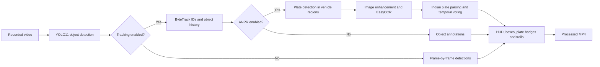

# IBVAP — Intelligent Border Video Analytics Platform

**An AI-assisted video analytics prototype for border, perimeter, and transport surveillance.** IBVAP processes recorded video with YOLO object detection, persistent multi-object tracking, motion-path visualization, and optional Automatic Number Plate Recognition (ANPR) for Indian registration plates.

> Built as a Smart India Hackathon (SIH) level project prototype. This repository provides an offline video-processing pipeline and model-training workflow; it is not a certified access-control, identity-verification, or operational border-security system.

## At a glance

- Detects people, vehicles, and other COCO objects in video using YOLO11.
- Assigns persistent IDs with ByteTrack and associates detections across frames.
- Draws bounding boxes, labels, a surveillance telemetry HUD, and configurable motion trails.
- Optionally detects vehicle plates, enhances plate crops, reads text with EasyOCR, parses common Indian registration formats, and combines repeated readings over time.
- Exports annotated MP4 video for review and can show a live OpenCV preview while processing.
- Includes a custom plate-detector training script, MLflow experiment logging, and a DVC pipeline definition.

## How it works



## Functionality

### Object detection

The YOLO11 detector returns class, confidence, and pixel bounding box for each object. By default it can detect all model classes; an optional class filter supports focused surveillance workflows. People and common vehicles (car, motorcycle, bus, truck) receive distinct annotation colors. The included model is `models/detection/yolo11n.pt`.

### Multi-object tracking and motion

ByteTrack tracking associates objects between frames and provides persistent track IDs. The pipeline records each track's bottom-center position (a useful approximation of ground contact), maintains bounded trajectory history, and draws fading motion trails. The tracking utilities also expose pixel-per-frame velocity, displacement, and a stationary-duration check for downstream analysis. These metrics are library capabilities; the CLI does not currently generate zone-crossing alerts or a separate analytics report.

### Optional ANPR

When enabled, ANPR runs against detected vehicles and associates plate readings with their vehicle track:

1. The custom YOLO plate model searches within each vehicle bounding box.
2. Plate crops are resized, denoised, contrast enhanced with CLAHE, sharpened, and passed to EasyOCR with an alphanumeric allowlist. A deskewed retry is available when the first OCR pass returns no text.
3. The parser cleans OCR output, applies common letter/digit confusion corrections, and recognizes standard Indian registration patterns and BH-series plates. It also accepts a generic alphanumeric fallback.
4. A per-vehicle temporal tracker combines repeated readings with confidence-weighted voting and can lock a stable result.
5. The output video can show a plate badge and detected plate region; the HUD includes the plate count.

OCR quality depends on plate visibility, resolution, lighting, camera angle, and model quality. A syntactically accepted plate is not proof of registration or identity.

### Video rendering and preview

The renderer processes a video file frame by frame, writes an annotated MP4, and optionally opens an OpenCV playback window (`q` exits preview early). The HUD reports processing mode, frame index, instantaneous FPS, timestamp, and detected person/vehicle/active-object counts. Default output is saved under `data/processed/videos/`.

### Model training and experiment tracking

`models/anpr/plate_detector.py` fine-tunes a YOLO model for one `license_plate` class. It records parameters and metrics in the local MLflow SQLite store (`mlflow.db`), writes metrics to `metrics.json`, and copies the best checkpoint to `models/anpr/plate_detector.pt`. The DVC pipeline (`dvc.yaml`) describes this plate-detector training stage using parameters in `params.yaml`.

## Repository layout

```text
configs/                 ANPR dataset and training configuration
data/raw/videos/         Example source videos
data/dataset/anpr/       Train, validation, and test image/label folders
data/processed/videos/   Default location for rendered output videos
models/detection/        YOLO11 base detector and detection wrapper
models/anpr/             Plate detector weights and training entry point
src/detection/           Detection-related package code
src/tracking/            ByteTrack integration, identity, and trajectory helpers
src/anpr/                Plate detection, OCR, parsing, and temporal aggregation
src/visualization/       Frame rendering and video processing pipeline
src/training/            Plate detection helper code
src/main.py              Command-line entry point
dvc.yaml, params.yaml    DVC pipeline and training parameters
```

## Requirements

- Python 3.10+ is recommended.
- For the Vercel showcase page, no third-party Python packages are required. The standard `requirements.txt` is intentionally lightweight.
- For local video inference and model training, install PyTorch and the packages in `requirements-ml.txt` (including Ultralytics, OpenCV, EasyOCR, MLflow, and DVC).
- CPU inference is supported; a CUDA-compatible PyTorch installation and GPU can accelerate inference and training.
- The base YOLO11 weights are checked in. The expected ANPR weight file is ignored by Git, so provide `models/anpr/plate_detector.pt` separately to run ANPR. EasyOCR may download its recognition data on first use.

## Installation

From the repository root, create and activate a virtual environment, then install dependencies:

```bash
python -m venv .venv
```

Windows PowerShell:

```powershell
.\.venv\Scripts\Activate.ps1
python -m pip install --upgrade pip
python -m pip install -r requirements-ml.txt
```

macOS/Linux:

```bash
source .venv/bin/activate
python -m pip install --upgrade pip
python -m pip install -r requirements-ml.txt
```

Install the PyTorch build appropriate for your CPU/CUDA setup before or as part of dependency installation if the default package resolver does not select the desired build. For a clean clone, confirm the model weights and sample videos are present; large assets may be managed separately through Git LFS or DVC depending on repository distribution.

## Run the video pipeline

The default input is `data/raw/videos/college_campus_raw.mp4`. Run tracking and trajectory rendering:

```bash
python -m src.main
```

Use a supplied video and choose an output path:

```bash
python -m src.main --input data/raw/videos/border_video.mp4 --output data/processed/videos/border_tracked.mp4
```

Enable ANPR and an OpenCV preview:

```bash
python -m src.main --input data/raw/videos/anpr/demo.mp4 --anpr --live
```

Detection-only mode, with trajectories disabled:

```bash
python -m src.main --input data/raw/videos/border_video.mp4 --no-track --no-trail
```

### CLI options

| Option | Default | Description |
| --- | --- | --- |
| `--input`, `-i` | `data/raw/videos/college_campus_raw.mp4` | Input video file path |
| `--output`, `-o` | Auto-generated in `data/processed/videos/` | Output annotated video path |
| `--model`, `-m` | `models/detection/yolo11n.pt` | YOLO11 object detection weights |
| `--plate-model` | `models/anpr/plate_detector.pt` | Custom license plate detector weights |
| `--conf`, `-c` | `0.35` | Detection confidence threshold (0–1) |
| `--anpr` | Off | Enable license plate recognition |
| `--no-track` | Off | Disable ByteTrack; use frame-by-frame detection |
| `--no-trail` | Off | Disable trajectory polylines |
| `--trail-length`, `-t` | `120` | Maximum stored trail points per object |
| `--live` | Off | Show live preview; press `q` to stop preview |

Input is currently expected to be a readable video file. Although the CLI help mentions camera indexes and RTSP URLs, the renderer checks for a filesystem path and does not currently support those sources.

## Train a plate detector

Prepare the dataset in YOLO detection format:

```text
data/dataset/anpr/
├── train/images/       # training images
├── train/labels/       # YOLO-format labels
├── val/images/         # validation images
├── val/labels/
└── test/images/        # optional test images
    test/labels/
```

Each image label file should contain YOLO normalized bounding boxes for class `0` (`license_plate`). Before training on another machine, edit `path` in `configs/anpr_data.yaml` to the local dataset root; the checked-in value is an absolute Windows path. Then run:

```bash
python models/anpr/plate_detector.py --epochs 15 --batch 6 --imgsz 640 --lr 0.01
```

Training reads the base weights and dataset location from `configs/anpr_data.yaml`, logs the run to `mlflow.db`, writes the best plate weights to `models/anpr/plate_detector.pt`, and exports metrics to `metrics.json`. The `train_anpr` values in `params.yaml` document the intended experiment parameters; the script's CLI arguments are the controls used by the command above.

To run the configured DVC stage, install DVC and use:

```bash
dvc repro
```

The DVC stage also expects the training dataset and training script paths listed in `dvc.yaml` to be available.

## Implementation map

| Area | Main files | Responsibility |
| --- | --- | --- |
| Entry point and pipeline | `src/main.py`, `src/visualization/video_render.py` | CLI options, orchestration, HUD, and video output |
| Detection | `models/detection/detector.py` | YOLO prediction and object annotations |
| Tracking | `src/tracking/tracker.py`, `object_identity.py` | ByteTrack association and persistent object metadata |
| Motion history | `src/tracking/trajectory.py` | Bounded trails, motion metrics, and trail drawing |
| Plate localization | `src/training/train_plate_yolo.py`, `src/anpr/anpr_pipeline.py` | Plate model inference and vehicle association |
| OCR and parsing | `src/anpr/plate_preprocessor.py`, `ocr.py`, `plate_parser.py` | Image enhancement, EasyOCR, and registration parsing |
| Temporal plate aggregation | `src/anpr/plate_tracker.py` | Per-track reading history, weighted votes, and stable plate selection |
| Training and MLOps | `models/anpr/plate_detector.py`, `dvc.yaml`, `params.yaml` | Training, metrics, and experiment tracking |

## Current scope and considerations

- The primary user-facing workflow is offline video processing. Live camera/RTSP ingestion, a web dashboard, alerting, database persistence, and geographic mapping are not implemented in the current CLI pipeline.
- Trajectory helpers provide pixel-space motion measurements. They do not perform calibrated real-world speed estimation, geofencing, or automated threat classification.
- ANPR depends on a trained plate model and EasyOCR; recognition should be reviewed by a human in operational settings.
- Use only video and plate data you are authorized to process, and apply appropriate privacy, retention, and access controls when adapting the prototype.

### Vercel showcase deployment

The Vercel entry point is the lightweight showcase handler exported by `src/main.py`; `/` serves the project page and `/health` returns service status. The deployed page presents the project and does not run video inference or accept uploads. The local computer-vision and training dependencies are kept in `requirements-ml.txt` and are not installed for the showcase deployment.

## License and contribution

No license or contribution policy is currently included in this repository. Add the project owner's chosen license and contribution process before accepting external contributions or redistributing the software.

---

**IBVAP | Intelligent Border Video Analytics Platform** — AI-assisted detection, tracking, and vehicle plate analytics for surveillance-video review.
